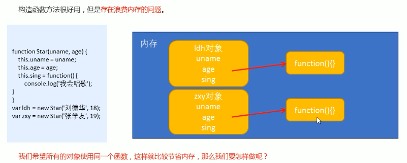
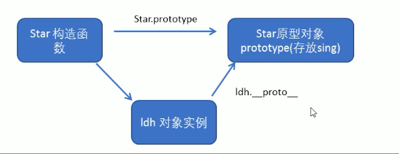
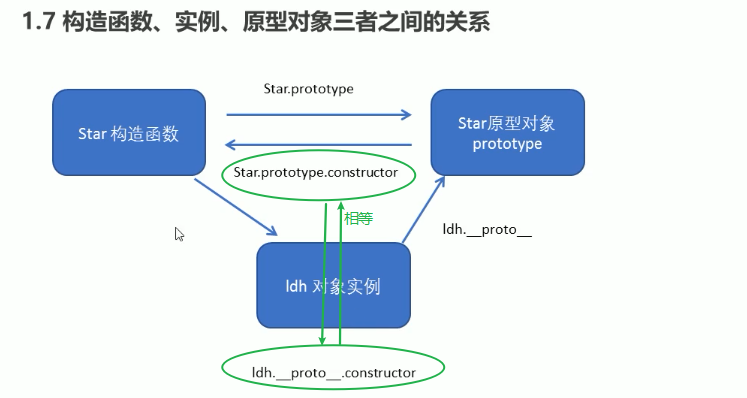
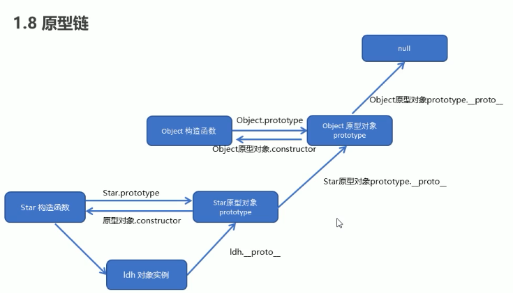
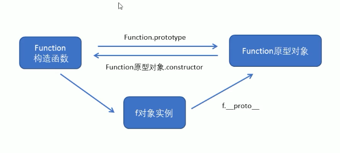

1. 类
    -  使用关键字`class`创建类
    - 举个栗子:
    ```
        class Star {
            constructor(uname){
                this.uname = uname;
            }
            sing(song){
                console.log(`${this.uname}+唱了+${song}`);
            }
        }

        var zhangsan = new Star('张三')
        var lisi = new Star('李四')
        console.log(zhangsan);
        console.log(lisi);
      ```
    - 类里面有个constructor函数, 可以接受传递过来的参数, 同事返回实例对象
    - construtor函数, 只要使用new生成实例时, 就会调用这个函数, 如果我们不写这个函数, 类也会自动生成这个函数
    - class类里面的函数不需要添加function关键字
    - 类的继承:
        - 使用`extends`关键字
        - 举个栗子:
            ```
            class Father {
                constructor(){

                }
            }
            class Son extends Father {
                constructor(){

                }
            }
            ```
        - `super`关键字用于访问和调用对象父类上的函数,. 可以调用父类的构造函数, 也可以调用父类的普通函数
        - 子类在构造函数中使用super关键字的话, 必须放到this前面(------> 也就是说必须先调用父类的构造方法, 再使用子类构造方法)
        - constructor里面的this指向实例对象, 方法里面的this指向这个方法的调用者
    - 双击禁止选中文字
        ```
        window.getSelection ? window.getSelection().removeAllRanges() : document.selection.empty();
        ```
    - 手动让文本框里面的文字处于选中状态
        ```
        inputEle.select();
        ```
2. 构造函数 和 原型
    - 创建对象的三种方式
        - 1. 利用`new Object()`创建对象
        - 2. 利用对象字面量创建对象 `var obj = {}`
        - 3. 利用构造函数创建对象
            - 举个栗子:
            ```
                function Star(uname, uage){
                    this.uname = uname;
                    this.age = age;
                    this.sing = function(){
                        console.log('我会唱歌哦')
                    }
                }

                var ldh = new Star('刘德华');
                var zxy = new Star("张学友");
            ```
            - new做了什么:
                - 1.在内存中创建一个新的空对象
                - 2.让this指向这个新创建的对象
                - 3.执行构造函数的代码, 给这个新对象添加属性和方法
                - 4.返回这个新对象(所以构造函数里面不需要return)
            - 静态成员和实例成员
                - 实例成员 :  就是构造函数内部通过this添加的成员, 实例成员只能通过实例化的对象来访问
                - 静态成员 :  就是在构造函数本身上添加的成员, 静态成员只能通过构造函数来访问, 不能通过实例化的对象来访问
            - 通过构造函数创建对象的问题:
                - 1.存在内存浪费的问题 
                    - 比如ldh和zxy两个通过构造函数创建的实例对象, 他们都含有sing方法(方法是写在构造函数里面的), 然后就会在对应的内存中开辟新的内存来存放这个方法 造成内存浪费, 通过打印`ldh.sing === zxy.sing`的值为false可以看出这两个对象的sing方法是放在不同内存地址上的
                    - ;

    - 原型
        - `原型prototype`是一个对象, 也叫原型对象
        - 构造函数通过原型分配的函数是所有对象共享的
        - js规定 : 每一个构造函数都有一个prototype属性, 指向另一个对象, 这个对象的所有属性和方法, 都会被构造函数所拥有
        - 我们可以把那些不变的方法, 直接定义在prototype对象上, 这样让所有对象的实例就可以共享这些方法
        - 一般情况下, 我们把公共属性定义到构造函数里面, 公共的方法我们放到原型对象身上
    - 对象原型__proto__
        - 对象内部都会有一个属性`__proto__`, 指向构造函数的prototype原型对象
        - 之所以对象可以使用构造函数prototype原型对象的属性和方法, 就是因为对象有__proto__原型的存在
            - 验证一下
            ```
            conole.log(ldh.__proto__ === Star.prototype); //  true, 说明这两个对象指向同一个内存地址
            ```
            - __proto__对象原型的意义就在于为对向的查找机制提供一个方向, 先查找对象本身是否有这个函数, 有的话就调用, 没有的话就去找对象原型__proto__对应的构造函数的原型对象prototype上查找有没有
            
    - `constructor构造函数`
        - `对象原型__proto__`和`构造函数原型对象prototype`里面都有一个`属性constructor`, 这个constructor我们称之为`构造函数`, 因为他指回构造函数本身
        - constructor主要用于记录该对象引用于哪个构造函数, 他可以让原型对象重新指向原来的构造函数
        - 很多情况下我们需要手动利用constructor这个属性指回原来的构造函数
            ```
               function Star(uname, uage){
                   this.uname = uname;
                   this.uage = age;
               } 
               // Star.prototype.sing = funnction(){ ... }
               // Star.prototype.movie = funnction(){ ... }
               Star.prototype = {
                   //这种写法完全改变的构造函数Star的prototype的指向, 指向了Object对象, 所以我们需要利用constructor属性将被改变的prototype指回原来的构造函数
                   // !!!!但是扩展数组原型上的方法的时候, 不建议这么写, 关于数组的只建议这么写Array.prototype.xxx = function(){ ... }
                   constructor: Star,
                   sing: function(){ ... },
                   movie: function(){ ... }
               }

               console.log(Star.prototype.constructor) // function Star(){ ... }
               console.log(ldh.__proto__.constructor)  // function Star(){ ... }
               
            ```
        - 
    - 原型链
        - 
        - js成员查找机制
            - 1.当访问一个对向的属性或者方法时候, 首先查找这个对象自身有没有该属性或者方法
            - 2.如果没有就查找他的原型(也就是实例对象的__proto__指向的构造函数的prototype原型对象)
            - 3.如果还是没有就查找原型对象的原型(实例对象的__proto__对应的构造函数的prototype原型对象的对象原型__proto__)
            - 4.以此类推一直找到Object为止(null)
    - this指向问题
        - 构造函数中的的this指向的实例对象
        - 原型对象函数里面的this指向的也是实例对象
            ```
            Star.prototype.sing = function(){ 
                // 这个原型对象的函数里面的this指向的也是实例对象
                }
            ```
    
    - 原型的应用之一 : 扩展内置对象
        - 给数组原型上扩展一个求和方法
        ```
        Array.prototype.sum = function(){
            var sum = 0;
            for(var i = 0; i < this.length; i++){
                sum += this[i];
            }

            return sum;
        }
        var arr = [1,2,3];
        arr.sum();
        ```
3. 继承
    - es6之前没有提供extends关键字继承, 所以使用 `构造函数 + 原型对象`模拟实现继承, 称之为`组合继承`
    - 构造函数继承父类的属性, 原型对象继承父类的方法
    - 举个栗子
        ```
        function Father(uname, uage){
            this.uname = uname;
            this.uage = uage;
        }
        fucntion Son(name, age, score){
            Father.call(this, name,age);    // --111-- 借用了父类的构造函数, 通过call方法把Father里面的this指向改成了Son, 所以就会给son实例增加两个父类的属性uname和uage
            this.score= score;
        }

        //Son.prototype = Father.prototype; // 这种继承父类方法的方式不可行, 因为这样父类子类的原型对象都是同一个内存地址, 指向同一个对象, 就不能做到子类父类的方法隔离了, 因为子类原型对象添加方法的时候也是加到了父类上的
        //实现继承父类原型上的方法的方式:
        Son.prototype = new Father();     // --222-- 将Son的原型对象指向一个父类的实例对象, 这个父类的实例对象又指向父类的原型对象, 所以子类可以通过原型链访问到父类的原型上的方法
        Son.prototype.constructor = Son;  // --333-- 上面一行改变了子类的原型对象的指向, 所以constructor也被改成了父类实例对象的constructor, 也就是Father, 所以子类还需要把constructor属性指回自己的构造函数

        var son = new Son(张三', 18, 99);
        ```
4. es5新增方法
    - arr.`forEach`(function(curItem, index, arr){ ... })
    - arr.`map`(function(curItem, index, arr){ ... })  对数组的每一个元素都做fun操作, 并返回操作后的结果数组
    - arr.`filter`(function(curItem, index, arr){ ... }) 筛选出符合条件的数组元素, 并返回这些元素组成的新数组
    - arr.`every`(function(curItem, index, arr){ ... }) 对数组的每一个元素都做fun操作, 看看是否全部元素都满足这个条件
    - arr.`some`(function(curItem, index, arr){ ... }) 对数组的每一个元素都做fun操作, 看看是否有元素满足这个条件
    - arr.`trim`() 去掉字符串两侧空格
    - `Object.keys()`获取对象自身所有的属性集合
        - 效果类似于`for...in`, 不同的是, Object.keys()只取自身的属性, for...in还会去取原型链上的属性
        - for...in可以搭配使用`obj.hasOwnProperty()`判断是实例的属性还是原型链的属性
    - `Object.defineProperty(obj, pro, descriptor)` 给对象新增属性, 或者修改原来的属性
        - 举个栗子:
        ```
        Object.defineProperty(obj, 'num', {
            value: 99,                          //属性的值, 默认为undefined
            writable: true|false(默认),         //是否可重写
            enumerable: true|false(默认),       //是否可枚举
            configurable: true|false(默认)       //是否可被删除或者是否可再次修改特性
        })
        ```
    - 
5. 函数 - 进阶
    - 函数的定义和调用
        - 函数的定义方式
            - 1.函数声明方式function关键字(命名函数)
                - `function f(){ ... }`
            - 2.函数表达式(匿名函数)
                - `var f = function(){ ... }`
            - 3.`new Function('形参1', '形参2', ... '函数体')`
                - ```
                    var f = new Function('a', 'b', 'console.log(a+b)');
                     f();
                  ```
                - **所有函数都是Function的实例(对象)**
                - **函数也属于对象Object**
                - 
        - 函数的调用方式
            - 1.普通函数
                - `f(); 或者 f.call();`
            - 2.对象的方法
                - `obj.say();`
            - 3.构造函数
                -`new Fun();`
            - 4.绑定事件函数
                - `btn.onclick = function(){ ... }`// 注意这种绑定事件函数体里面的this指向调用者, 也就是btn
            - 5.定时器函数
                - `setInterval(function(){ ... }, 1000)`
            - 6.立即执行函数
                - `(function(){ ... })()`
    - this指向
        - 1.普通函数调用: window            -----> console.log(this) // "[object Window]"
        - 2.对象方法调用: 该方法所属对象        -----> console.log(this) // "[object Object]"
        - 3.构造函数调用: 实例对象, 原型对象里面的方法也指向实例对象        -----> console.log(this) // "[object Object]"
        - 4.事件绑定方法: 绑定事件的对象        -----> btn.onclick = function(){ console.log(this) } // "[object HTMLButtonElement]"
        - 5.定时器函数: window      -----> console.log(this) // "[object Window]"
        - 6.立即执行函数: window        -----> console.log(this) // "[object Window]"
        - 改变函数内部this指向
            - `f.call(thisArg, 参数1, 参数2, ...)`;
                - 返回的是函数调用的返回值
            - `f.apply(thisArg, [参数1, 参数2, ...])`
                - 返回的是函数调用的返回值
                - ```
                    var arr = [1,3,9];
                    var max = Math.max.apply(Math, arr); //利用apply 借助Math.max方法 求出数组最大值, apply改变的那个this值可以是null,严格模式下要写成Math
                  ```
            - `f.bind(thisArg, 参数1, 参数2, ...)`
                - bind方法不会调用函数, 但是可以改变函数内部this指向
                - 返回的是由指定的this和初始化参数改造的**原函数拷贝**
                - 举个栗子:
                    ```
                    var o = {
                        name: '张三'
                    };

                     function fn(){
                         console.log(this);
                     }

                    var f = fn.bind(o);
                    f();
                    ```
    - 严格模式
    - 高阶函数
    - 闭包
    - 递归
    

    
