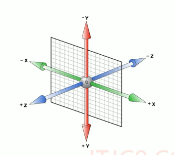

1. 滤镜filter : 将模糊或者颜色偏移等图形效果应用于元素
    - `filter: 函数()`
    - 举个栗子: `filter: blur(5)` blur模糊处理, 数值越大越模糊
2. 函数calc() : 在声明css属性时候执行一些计算
    - 举个栗子 `width: calc(100% -80px);` 设置了这个属性的元素的宽度不管父元素的大小怎么变化,总是会比父元素小80像素
3. css3过渡transition:
    - `transition: 要过渡的属性 花费时间 运动曲线 何时开始`
    - 属性可以是宽高背景色之类的 如果想要所有属性都过渡, 用all
    - 花费的时间单位是秒s, 必须写单位, 比如0.5s
    - 运动曲线: 默认是ease(可以省略),还可以用liner | ease-in | ease-out | ease-in-out
    - 开始时间: 设置延迟触发时间, 单位是秒s, 必须写单位, 默认是0s(可以省略)
    - **transition属性是谁过渡就给谁加**  比如一个鼠标悬浮在一个进度条上 进度条的宽度会过渡变长变短, 这个进度条有一个父盒子是进度条的外边框, 父盒子里面有一个子盒子,是进度条的进度内容, 鼠标悬浮进度条内容盒子变长变短,这个transition属性是要加在子盒子上的, 而不是父盒子  -------------> **谁的属性要过渡就给谁加transition属性**
    - transition一般搭配:hover伪类选择器使用
        - 举个栗子 
        - 
4. 2d转换**transform**
    - 旋转 rotate
        - `transform: rotate(45deg);`
    - 转换中心点 transform-origin
        - `transform-origin: x y`;
        - x y 默认转换的中心点是元素的中心点(50% 50%)
        - 还可以给x y设置像素值 或者 方 位名词
    - 缩放 scale
        - `transform: scale(x, y);`
        - 缩放的数值是用逗号隔开的
        - x y可以只写一个值, 代表两个参数取值都是同一个值
        - 对比直接设置width/height来修改元素的的大小,  scale的优势是: 可以设置转换中心点缩放, 默认以中心点缩放的, 而且不影响其他盒子
    - 位移 translate
        - `transform: translate(x, y);`
        - `transform: translateX(x);`
        - `transform: translateY(y);`
        - x|y的数值如果是%, 那么移动的这个距离是盒子自身的宽度或者高度的百分比
        - 位移translate 对行内标签没有效果
    - 转换tranform使用综合写法的时候, 原则上只要各个转换用空格隔开就行了, 但是要注意下   !!!!  **先平移translate再旋转rotate 跟 先旋转rotate再平移translate的结果是不一样的** , 因为旋转会改变坐标轴
        - **重点:     当有位移和其他属性一起做转换的时候  先把位移放到最前面**
5. 3d转换
    - 3d转换中的坐标系, x正方向向右, y正方向向下, z正方向从屏幕往外到人眼的这个方向
        -  
    - 3d转换中的位移:
        - `transform: translateX(5px) translateY(10px) translateZ(100px)`
        - `transform: translate3d(x,y,z)`   ------------------> 对比2d的位移translate, 3d的位移用的是translate3d 
        - 一般translate中的z值都是像素值
        - translateZ值越大 离我们的眼睛越近, 离屏幕越远, 那么看到的物体越大, 可以是负值
    - 透视 perspective - 也叫视距(人眼到屏幕的距离)
        - 在网页产生3d效果需要透视(可以理解成3d物体投影在2d平面内)
        - 视距越大距离屏幕越远,看到的元素越小, ---------------> 近大远小 (对比记忆: 如果tranlateZ值越大说明元素离我们的眼睛越近, 那么看到的元素就越大, 跟视距的值是反着的)
        - 透视的单位是像素
        - ```
            body {
                perspective: 500px;
            }
          ```
        - **透视写在被观察的盒子的父元素上**
        -  
    - 3d旋转
        - `transform: roateX(45deg)`; 表示绕x轴旋转45度
        - 旋转的度数有正有负, 正值的方向是想屏幕内侧翻转的     ------------------>   伸出左手, 大拇指朝向x轴正方向, 剩下的四指指向的就是绕x轴旋转正值的方向
        - `transform: rotate3d(x, y, z, deg)` 沿着自定义轴旋转deg角度
            - xzy表示矢量, 如果只沿着x轴旋转那么只有x值是1,yz都是0;  如果x=1,y=1,z=0,那么就是沿着xy形成的矢量旋转deg度, 就是沿着自定义轴旋转了
    - **3d呈现 transform-style**   重要!!!
        - 控制子元素是否开启三维立体环境
        - `transform-style: flat;` 默认值, 子元素不开启(保留)3d立体空间
        - `transform-style: perserve-3d` 子元素开启(保留)立体空间
        - transform-style用在父盒子身上, 控制其下面的子元素是否开启(保留)3d立体空间的呈现
6. 动画 animation
    - 可以通过设置多个节点来精确控制一个或一组动画, 常用来实现复杂的动画效果
    - 相比较过渡transition, 动画可以实现更多变化, 更多控制,连续自动播放等效果
    - 先定义动画, 再使用动画
        - 用keyframes(动画序列)定义动画
            - ```
                @keyframes 动画名称 {
                    0%{
                        ......
                    }
                    15%{
                        ......
                    }
                    100%{
                        ......
                    }
                }
              ```
            - 上面的百分比是用来规定变化发生的时间划分, 可以使用关键词`from`和`to`, 等同于`0%`和`100%`
    - 在选择器内部使用animation调用上面的动画序列keyframes
        - 分开写
          ```
           div{
              width: 200px;
              animation-name: 动画名称;
              animation-duration: 动画时间;
              animation-xxx ....
              .........
            }
          ```
        - 常用动画属性
            - animation 所有动画属性的间歇属性, 除了animation-play-state属性
            - animation-name 动画名称(必须)
            - animation-duration 完成一个动画所要的时间周期,单位是秒或者毫秒, 默认是0. (必须)
            - animation-timing-function 动画的运动曲线, 默认是ease, 还可取值liner, ease-in...还有一个好玩的steps(x)表示这个动画分x步完成
            - animation-delay 动画延迟时间, 默认是0
            - animation-iteration-count 动画被播放的次数, 默认是1, 还可以取值2,3....  当然无限多次可以用infinite
            - animation-direction 动画是否在下一周期逆序播放, 默认是normal, alternate逆播放
            - animation-play-state 设置动画运行或者暂停, 默认是running, 还可取值paused
            - animation-fill-mode 动画结束后状态, 保持forwards, 回到起始backwards(默认)
        - 简写
            - `animation: 动画名称 持续时间 运动曲线 何时开始 播放次数 是否反方向 动画起始或者结束的状态;
7. 浏览器私有前缀
    - `-moz-` firefox浏览器私有前缀
    - `-ms-` ie浏览器私有属性
    - `-webkit-` safari, chrome浏览器的私有属性
    - `-o-` opera浏览器私有属性


    


