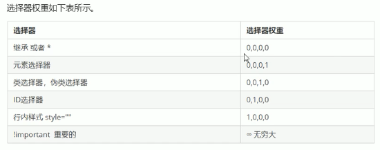
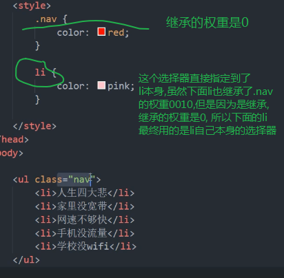

1. 层叠性
    - 相同的样式属性设置 后面设置的会覆盖掉前面的
2. 继承性
    - 子标签会继承父标签的某些样式 `(主要是一些跟文字属性相关的, text-, font-, line-这些开头的可以继承, 还有color属性也会继承)`
    - 特殊的继承: `只有数值但不带单位的行高的继承`
        - ```
            div {
                font: 12px/24px 'Microsoft YaHei';//字号12px 行高24px 行高会被继承
            }
          ```
        - ```
            body {
                font: 12px/1.5 'Microsoft YaHei';//字号12px 行高是元素字号的1.5倍 行高会被继承
            }
            div {
                //子元素继承了上面父元素body的行高1.5
                font-size: 14px;//当子元素自己设置了字号大小 父元素的行高设置了数值但是没有设置单位的时候  子元素的行高实际上是子元素自己的字号大小*父元素的不带单位的行高数值
            }
          ```
3. 优先级
    - 当一个元素指定多个选择器, 就会有优先级的产生
        - 选择器相同, 执行层叠性
        - 选择器不同, 根据`选择器权重`执行 
            
            - 特别注意: `继承的权重是0`, 如果该元素没有直接选中, 不管父元素权重多高, 子元素得到的权重都是0
         - 选择器权重的叠加计算, 不会进位.
         - 当子元素本身有直接指定到自身的选择器时候, 即便继承的父级元素的选择器权重再高, 子元素这个时候继承的父元素的选择器的权重都是0
            
