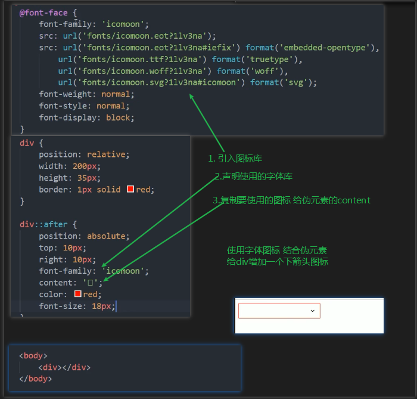
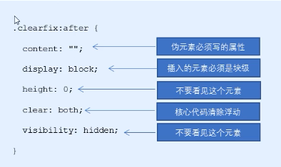
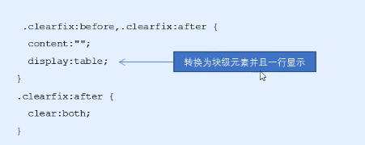

1. 伪元素选择器 
    - 是利用css创建新的标签元素, 而不需要html标签, 从而简化html结构
    - `E::before {content:""   }`在元素E**内部**的前面插入内容(插入的内容是E的子级)
    - `E::after  {content:""   }`在元素E**内部**的后面插入内容(插入的内容是E的子级)
    - before和after创建一个元素, 但是属于行内元素
    - 新创建的这个元素在文档树中是找不到的, 所以我们称之为伪元素
    - before和after必须要有content属性
    - 伪元素选择器和标签选择器一样, 权重是1
    - `div::after {content:""     }` 伪元素选择器的权重是 1+1 = 2   
2. 伪元素选择器的使用
    - 2.1 伪元素字体图标
        - 
    - 2.2 伪元素清除浮动
        - 
        - 
        - 顺便复习一下清除浮动的另两种方式
            - 别的方法1: w3c推荐在html文档里面需要清除浮动的盒子里面增加一个元素,**这个元素必须是块级元素**, 设置一下清除浮动{clear:both}   ------>  **额外标签法**
            - 别的方法2: 需要清除浮动的盒子添加overflow属性
        
        

