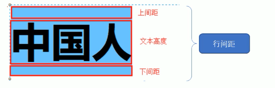

1. font: font-style font-weight font-size/line-height font-family
    - 上面的属性可以不用全写 但是font-size和font-family必须要有
2. text-align 文本对齐方式 left right center
3. text-decoration 文本装饰 none underline overline line-through
4. text-indent 文本首行缩进 
    - 可以使用px像素大小 就是缩进像素大小的距离
    - 可以使用em作为单位 这样缩进的值就当前元素设置的一个字体的大小的距离 如果当前元素没有设置字体大小 那么就会读取他的父元素的设置的文本大小作为一个缩进距离
5. line-height 行间距 设置行与行之间的距离 
    - 行间距的组成: 上间距+文本高度+下间距  如果行间距大于文本高度 那么扩大的就是上间距和下间距
    
6. 内部样式表
    - 将css样式代码抽取出来 单独放在`<style></style>`标签里面, 直接写在html文档内部,可以控制整个当前页面
    - 理论上内部样式表可以放在html文档任何地方 但是一般都会放在`head`标签中
7. 行内样式表
    - 放在元素标签内部的style属性找中的样式设定, 用来控制当前标签的样式, 适合修改简单样式
8. 外部样式表
    - 样式单独写在css文件中 使用的时候再html文件中引入即可
    - 使用link标签引入外部样式表
        ```
        <link rel='stylesheet' href='css文件路径'>
        ```
