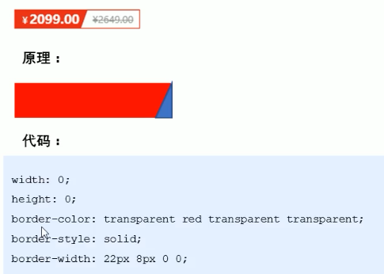
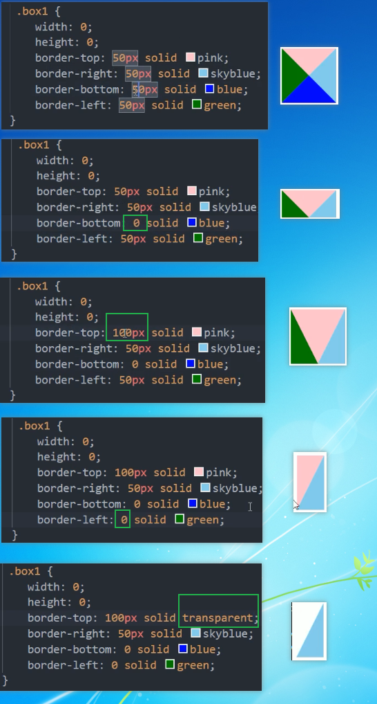

1. 外边距margin负值应用
    - 当一组商品盒子都有外边框的时候, 可以给盒子添加一像素的边框, 但是盒子与盒子之间即便添加了浮动还是会有一定的距离 或者挨得很近但是视觉上有两像素的相邻边框,这个时候可以利用
    `margin-left: -1px;` 将盒子向左移动-1像素, 则相邻盒子之间的相邻边框就只有一像素大小了
    - 上面一组商品盒子使用了浮动布局, 也利用了外边距负值解决了相邻边框诗句变粗的问题, 但是如果鼠标悬浮在盒子上要求边框变个颜色的话,那么每一行除了最右边的盒子 其余的盒子有边框都会被后面的压住不显示右边框
        - 解决办法1: 每个盒子保留原来的浮动布局的时候, 当每个盒子自己hover时, 将这个盒子的布局改成定位, 这样就解决了
        - 解决办法2: 每个盒子都使用相对定位布局, 这样既保留了原位置占有, 还能解决上面的问题, 如果不能, 在每个盒子hover时候, 将这个盒子z-index值提高即可;
2. 文字环绕浮动元素
    - 浮动元素会脱标 不占有自己原先位置 会压住其他标准流盒子 但是不会压住标准流的文本 文本会自动形成一种环绕这个浮动盒子的效果
3. 行内块的巧妙运用
    - 行内块元素 既可以设置宽高 行内块元素与行内块元素之间本身就有空隙 没有额外要求的情况下可以不用再去设置margin值了   而且行内块元素可以方便的设置水平+垂直居中`textalign: center;`+`line-height: 元素高px`
4. css三角强化
    - 
    - 
    
