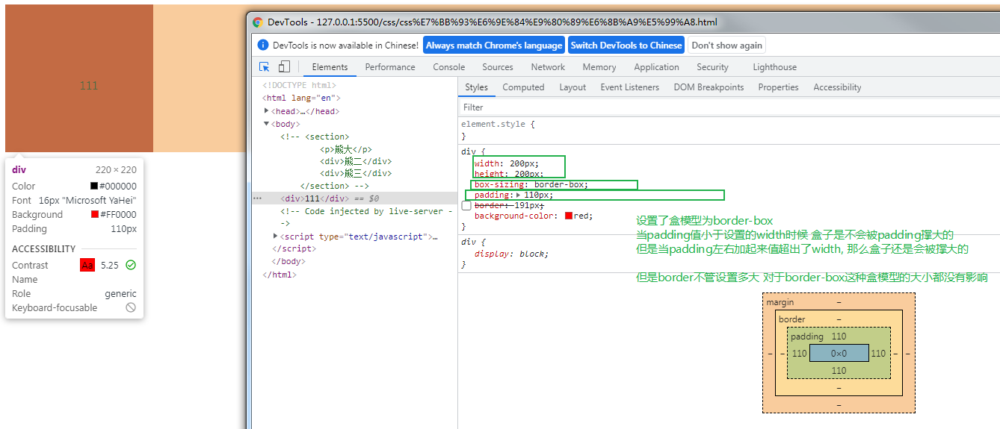

1. border
    - boder-width, border-style, border-color
    - `border: 1px solid red;`
2. padding
    - `padding: 5px, 10px, 20px;` ---> 上内边距5 左右内边距10 下内边距20
    - **<font color='DeepPink'>如果盒子本身没有明确指定width/height属性, 则此时padding不会撑开盒子大小</font>**, 这种情况一般都在是子元素的宽/高继承自父元素的盒子 不用再去手动指明子元素自己的宽/高,这个时候子元素增加padding属性是不会改变自己的宽/高的
3. margin
    - `margin: 5px, 10px, 20px;` ---> 上外边距5 左右外边距10 下外边距20
    - 利用外边距可以让**明确指定了宽度属性**的**块级盒子**左右居中
        - 块级盒子
        - 块级盒子必须明确指定了宽度
        - 盒子的左右外边距都设置为auto
        - ```
            .div {
                width: 100px;
                margin: 0 auto;
            }
          ```
        - 对比记忆: 
            - **让行内元素或者行内块元素左右居中, 给其父元素添加text-align: center属性即可**
        - 块元素外边距合并:
            - 上下相邻的兄弟块元素垂直外边距合并:
                - 取上面的块元素的下外边距和下面的块元素的上外边距之间的最大值作为两者之间的距离
                - 解决方案: 尽量避免同时设定外边距
            - 父子块元素之间的垂直外边距合并: 也叫塌陷
                - 对于两个嵌套关系的块元素, 父元素有上外边距的同时子元素也有上外边距, 此时父元素会塌陷两者之间数值较大的外边距值
                - 解决方案:
                    - 可以为父元素定义上边框 (缺点是可能会撑大盒子)
                    - 可以为父元素定义上内边距 (缺点是可能会撑大盒子)
                    - 可以为父元素添加`over-flow: hidden;`属性
                    - 还有其他方法: `浮动 固定 绝对定位的盒子不会有塌陷问题`
        - `行内元素为了照顾兼容性, 尽量只设置左右内/外边距, 不要设置上下内/外边距, 因为即便设置了上下内/外边距也不会生效的, 除非将行内元素转换为行内块元素或者块元素`
4. border-radius:
    - `border-radius: mpx | m%`
    - border-top-left-radius, border-top-right-radius, border-bottom-left-radius, border-bottom-right-radius
5. 盒子阴影
    - `box-shadow:h-shadow v-shadow blur spread color inset`
    - `box-shadow: 水平阴影的位置(必需,可以负值) 垂直阴影的位置(必需,可以负值) 模糊距离 阴影的尺寸 阴影颜色 内部|外部阴影`
    - 默认是外阴影outset 但是不可以写出这个单词 否则无效 但是可以写inset设置成内阴影
    - 盒子阴影不占用空间 不影响其他盒子排列
6. 文字阴影
    - `text-shadow: h-shadow v-shadow blur color`
    - h-shadow 和 v-shadow是必需的

7.两种盒模型的区别
    - `box-sizing: content-box` 这是默认的盒模型 盒子的宽度 = width + padding + border  ------> 这个width是我们在样式里面写的那个width, 所以这种默认的盒模型会被padding和border撑大盒子, 盒子最终的实际大小是三者之和
    - `box-sizing: border-box`  这是新的盒模型, 盒子的宽度 = width,  -------------------------> 这个width是我们在样式里面写的那个width, 这种盒模型不会被padding和border撑大(前提是pading和border不会超出设置的width, 否则还是会撑大)
        - 

