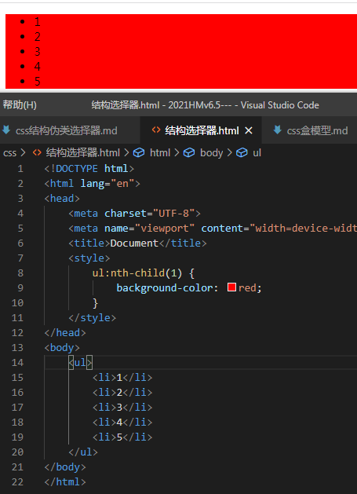
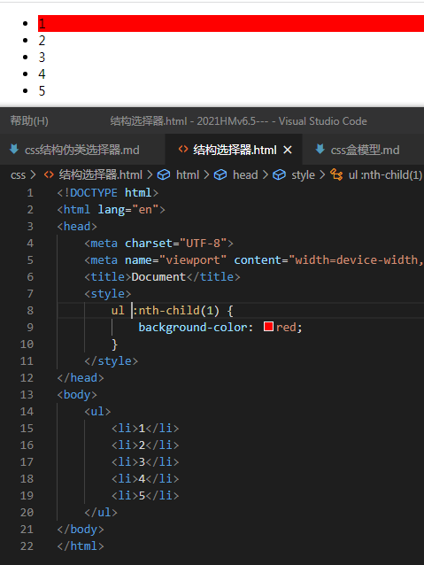
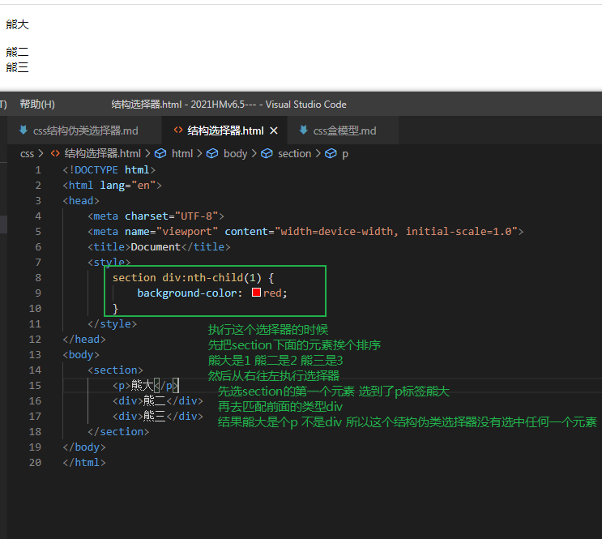
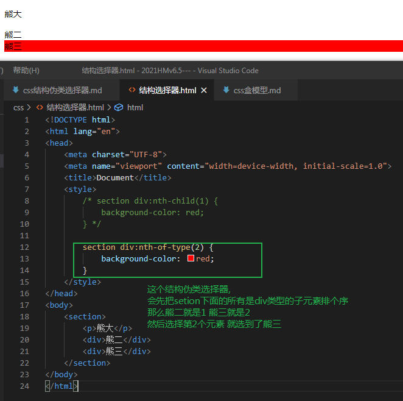

1. 结构伪类选择器
    - 结构伪类选择器是根据文档结构来进行选择元素的, 常用于根据父级选择里面的子元素
    - 括号里面可是数字,可以是英文odd|even, 可以是公式(公式里面的字母必须是n)
    - n从0开始
    - `E:first-child` 匹配父元素中的第一个子元素
    - `E:last-child` 匹配父元素中最后一个元素
    - `E:nth-child(n)` 匹配父元素中能够第n个子元素
    - `E:first-of-type` 指定类型的第一个
    - `E:last-of-type` 指定类型的最后一个
    - `E:nth-of-type(n)` 指定类型的第n个
    - E和:之间不能有空格, 否则意义就变了. 
        - `E:nth-child(n)`E与之间没有空格, 代表的是属于父元素的第n个子元素E
            
        - `E :nth-child(n)`E与:之间有空格, 代表的是属于E儿子层级的第n个元素 元素类型是啥都可以,因为这个空格之前没有紧跟任何选择器,所以是啥都能匹配
            
        - E与:之间没有空格, 这个结构伪类选择器代表的意思是属于父元素的第n个元素**且**类型是E的子元素, 必须是这两个条件都满足才会被选中.
            - 这个结伪类选择器是从后往前选择的
            - 
    - `:nth-child(even | odd)` 选择属于父元素的第 偶数 | 奇数 个元素们
    - `:nth-child(3n+1)` 括号里面可以是公式, 但是公式含有的字母必须是n, 比如3n+1,代表选中1, 4, 7, 10.....这样的序列的子元素
    - `:nth-child(n+5)` 代表从第5个开始选到最后
    - `:nth-child(-n+5)` 代表选择前5个
    - `E:nth-of-type(n)`代表先把父元素下面**类型是E的所有子元素排个序** 然后按照有类型的顺序选择第n个子元素
        - nth-of-type与nth-child执行顺序相反的, nth-of-type从左往右执行, 先找到所有匹配的子类型, 给他们拍个序, 再去找第n个
        - 举个栗子
        - 

