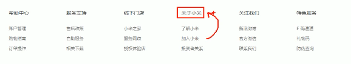
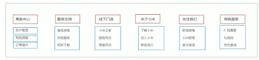
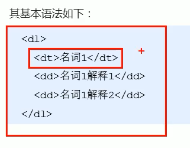

1. <!DOCTYPE> 声明不是 HTML 标签；它是指示 web 浏览器关于页面使用哪个 HTML 版本进行编写的指令。
   - <!DOCTYPE> 声明没有结束标签。
   - <!DOCTYPE> 声明对大小写不敏感。
   - `<!DOCTYPE html>` 声明文档使用Html5版本
2. `<meta charset='UTF-8'>`
   - 通过meta的charset属性来规定html文档使用哪种字符编码
   - charset常用的值有GB2312 GBK UTF-8, 其中UTF-8也别称作**万国码**,基本包含了全世界所有国家需要用到的字符
   - charset 一定要写 否则网页可能会出现乱码
3. div标签用来布局 一行只能放一个
4. span标签用来布局 意为跨度 跨距, 一行上可以有多个span
5. img标签
   - src属性是图片的路径
   - alt属性表示图片不能显示的时候的替换文字
   - title属性标识提示文本 鼠标悬浮在图片上面的时候的文字
   - width和height属性设置的是具体的数值 不带单位, 这两个一般只设置一个 另一个会跟着等比缩放
6. 路径
   - 相对路径:
      - 是指:以引用文件所在位置为参考基础, 而建立出的目录路径
         - 同一级路径: 图像文件位于当前文件同一级 ``
         - 下一级路径: 图像文件位于当前文件下一级 ``
         - 上一级路径: 图像文件位于当前文件上一级 ``
   - 绝对路径:
      - 是指:目录下的绝对位置,直接到达目标位置,通常是从盘符开始的路径或者完整的网络地址
      - 例如 `D:\Program Files\eclipse-java-mars-2-win32-x86_64\baidu.png`或者`https://www.cnblogs.com/itfky/baidu.png`
7. 超链接标签
   - 语法格式: `<a href='跳转目标' target='目标窗口的弹出方式'>文本或者图像</a>`
   - 外部链接: `<a href='http://www.baidu.com'>百度</a>`
   - 内部链接: `<a href='index.html'>网站内部页面之间的相互链接</a>`
   - 空链接: `<a href='#'>空链接a标签的href属性值是#</a>`
   - 下载链接: `<a href='baidu.png'>下载链接的href值是文件||.exe||.zip压缩包等形式</a>`
   - 网页元素链接: 在网页中的各种网页元素, 如文本, 图像, 表格, 音频, 视频等都可以添加超链接,把这些元素的标签用a标签包裹起来即可
      - `<a href='http://www.baidu.com'></a>`
   - 锚点链接: 点击链接,可以快速定位到页面中的某个位置
      - 在链接的href属性中, 设置属性值为 `#跳转元素的id` 的形式, 如`<a href='#userInfo'></a>`
8. 特殊字符:
   - 在html页面中, 一些特殊的符号很难或者不方便直接使用, 此时我们便可以使用特殊字符来代替
      - 小于号 `<`   ---   `&lt;`
      - 大于号 `>`   ---   `&gt;`
      - 空格符       ---   `&nbsp;`
      - 人民币 ¥     ---   `&yen;`
      - 平方2(上标2) ---   `&sup2`
      - 立方3(上标3) ---   `&sup3`
9. 无序列表 ul
   - 无序列表的各个列表项之间没有顺序级别之分, 是并列的
   - `<ul>`与`</ul>`之间只能嵌套`<li>`标签
   - `<li>`与`</li>`之间相当于一个容器, 可以容纳所有元素
   - 无序列表是自带样式属性的 一般开发的时候都会去掉这个默认属性的
10. 有序列表 `<ol></ol>`
   - 有序列表的子项是默认有序的
   - 有序列表ol之间只能放置li标签
   - 有序列表的li标签相当于一个容器. 可以容纳所有元素
   - 有序列表自带样式属性 一半开发也会去掉这个默认属性的

11. 自定义列表
   - 使用`<dl></dl>`实现, 第一个层级使用`<dt>名词</dt>`描述名词, 第二个及后面若干个名词解释使用`<dd>名词解释1</dd>`来描述
   - 自定义列表应用
      - 
   - 自定义列表应用2
      - 
   - 自定义列表语法
      - 
12. 表单`<form>`
   - 表单会把他范围内的表单元素信息提交给服务器
   - 表单域 + 表单控件 + 提示信息
   - ``` 
      <form action='url地址' method='表单数据的提交方式' name='表单域名称,用以区分一个页面中的多个表单域'>
            各种表单控件 
      </form>
      ```
      - action:指定处理表单数据的服务器url地址
      - method:表单数据的提交方式(post||get)
      - name:表单域名称,用以区分一个页面中的多个表单域
   - input控件
      - 是单标签, 格式为
         ```
         <input type='类型' name='' value='' checked='checked' selected='selected' maxlength=正整数>
         ```
      - `type='radio'` 表示单选控件 
         - **一组单选控件的name属性值相同**, 这样便可以实现一组单选控件**多选一**的效果
         - 举个栗子
            ``` 
            <input type='radio' value='男' name='sex'>
            <input type='radio' value='女' name='sex' checked='checked'>
            ```
      - `type='checkbox'` 表示复选控件 
         - **一组复选控件的name属性要相同**
         - 举个栗子
            ```
            <input type='checkbox' value='篮球' name='hobby' checked='checked'>
            <input type='checkbox' value='足球' name='hobby'>
            <input type='checkbox' value='滑冰' name='hobby' checked='checked'>
            ```
      - `type='button'` 表示普通按钮 一般触发js事件
         - 举个栗子
            ```
            <input type='button' value='获取短信验证码'>
            ```
      - `<label></label>标签` 不属于表单控件 但是常常用于绑定表单元素 扩展鼠标点击范围 
         - label标签的for属性值必须是需要绑定的表单控件的id
         - 举个栗子
            ```
            <label for='man'>男</label>
            <input type='radio' value='man' name='sex' id='man'>

            <label for='woman'>女</label>
            <input type='radio' value='woman' name='sex' id='woman'>
            ```
   - select下拉表单控件
      - 当`selected='selected'`时,表示默认选中一个选项
      - 举个栗子
         ```
         <select name='homeland'>
            <option>山东</option>
            <option selected='selected'>江苏</option>
            <option>上海</option>
         </select>
         ```
   - textarea文本域控件
      - 举个栗子
         ```
         <textarea name='msg' rows='3' cols='10'>文本内容</textarea>
         ```
      - 实际开发中不会使用cols和rows来控制行列数,会用css来控制
   
