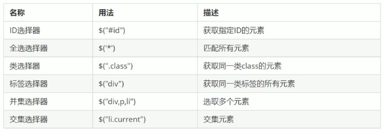
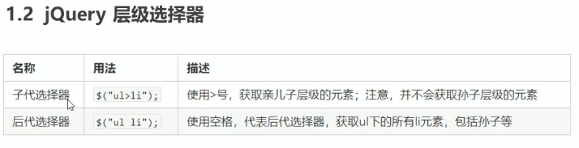
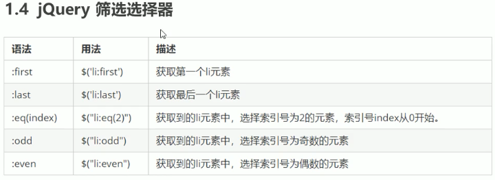
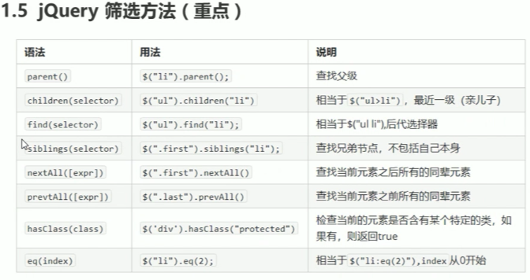

1. jQuery基本使用
    - 引入jquery
    - 等待页面DOM加载完毕后执行, 相当于原生JS中的DOMContentLoaded
        - `$(document).ready(function(){.....});`
        - `$(function(){...});`
    - 顶层对象`$` 或者 `jQuery`, 类似于原生js中的window
    - DOM对象和jQuery对象
        - DOM对象是用原生js获取到的对象, jQuery对象是用jQuery方法获取到的对象
        - jQuery对象的本质是利用$对DOM对象包装后产生的对象(伪数组形式存储)
        - **jQuery对象只能使用jQuery方法, DOM对象则使用原生的js属性和方法**
        - jQuery对象和DOM对象之间的相互转换
            - dom对象转jQuery对象  `$(DOM对象)`     ----------> $(document.querySelector('div'));
            - jQuery对象转DOM对象  `$('div')[index]` 或者 `$('div').get(index)`
2. jQuery选择器
    - `$('选择器')`
    - 
    - 
    - 
        - **所有的索引号都是从0开始的**
    - 
    - `隐式迭代`
        - jQuery选择器匹配到对象后执行一个方法的时候, 会自己进行循环遍历所有匹配到的对象, 执行相应的方法, 而不用我们自己再去进行循环遍历操作
    - `$(this)` 在事件处理函数里面指代当前匹配到的元素
    - `$(this).index()` 在事件处理函数里面指代当前匹配到的元素的index值, 从0开始
    - `$('div').parents()` 获取所有祖先元素
    - `$('div').parents('选择器')` 获取指定的祖先元素
3. jQuery修改样式
    - `$('div').css('backGround','red')` 利用$对象的css()修改某个样式     ---->比如这里修改背景色
    - `$('div').addClass('类名')` 添加类名
    - `$('div').removeClass('类名')` 删除类名
    - `$('div').toggleClass('类名')` 切换类名
4. jQuery动画
    - `show(时间,动画方式ease,fun)`, `hide(时间,动画方式ease,fun)`
    - `slideUp(时间,动画方式ease,fun)`, `slideDown(时间,动画方式ease,fun)`, `slideToggle(时间,动画方式ease,fun)`
    - `fadeIn(时间,动画方式ease,fun)`, `fadeOut(时间,动画方式ease,fun)`, `fadeTogle(时间,动画方式ease,fun)`
    - `fadeTo(时间,opacity,动画方式ease,fun)`  -- opacity必须填写, 其余都可省略
    - **自定义动画** `animate(属性的集合对象, 时间, 动画方式ease, fun)`
        - 自定义动画里面修改属性使用对象来修改的
        - `$(dom元素).animate({scrollTop:0})` -----> 注意点!!!调用animate的jquery对象里面的dom元素只能是document之外的所有元素, 甚至写html,body都可以, 就是document不行, 因为你想啊,整个document做滚动的时候是html和body滚动, 而不是document滚动   -----> 所以最优写法是`$(body, html).stop().animate({scrollTop:0})`
    - 事件切换 `hover(over, out)` over函数可以省略
        - over函数: 鼠标经过执行的动画
        - out函数: 鼠标离开执行的动画
        - 如果只有一个参数, 代表鼠标经过和离开都执行这同一个函数
    - 停止动画排队
        - 动画一旦触发就会执行, 快速切换或者多次触发就会造成多个动画或者效果排队执行, 可以使用stop()停止动画排队, 去做最新的动画(也就是说, 最好在每次使用动画之前都手动调用一下stop()再调用动画)

5. jQuery属性操作
    - 固有属性 `prop()`
        - 获取固有属性 `prop('属性')`
        - 设置固有属性 `prop('属性', '属性值')`
    - 自定义属性 `attr()`           ---- 类似于h5原生的自定义书属性操作 getAttrbute/setAttrbute
        - 获取自定义属性 `attr('属性')`
        - 设置自定义属性 `attr('属性','属性值')`
        - 如果自定义属性是以data-开头的, 这个里面要写全, 写data-xxx
    - 数据缓存 data()     -------这个里面的数据是存在元素的内存里面的
        - 获取数据 `data('属性')`
        - 设置数据 `data('属性','属性值')`
        - 也可以获取h5的自定义属性data-xxx, 但是这个方法里面不用加上data-这个开头, 直接data('xxx')即可
6. jQuery文本属性
    - 普通元素内容 `html()`
        - 获取元素内容 `$(div).html()`
        - 设置元素内容 `$(div).html("xxx")`
    - 普通元素文本内容 `text()`
        - 获取元素文本内容 `$(div).text()`
        - 设置元素文本内容 `$(div).text("xxx")`
    - 表单元素的值 `value()`
        - 获取表单元素的值 `$('input').value()`
        - 设置表单元素的值 `$('input').value('xxx')`
7. jQuery元素操作
    - 遍历元素
        - jQuery本身就有隐式迭代, 可以调用jQuery方法对选择器匹配到的同一类元素做同样的操作, 如果需要做不同操作就要用到遍历
        - `$('div').each(function(index, domEle){ ... })`
            - 回调函数的第二个参数是dom元素, 如果需要使用jquery对象的方法, 需要用$()括起来转化成jquery对象再去操作
        - `$.each(obj, function(index, ele){ ... }` 
            - 可以遍历任何对象, 主要用于数据处理, 比如数组, 对象等
            - obj是jquery对象的话, index是伪数组的下标, ele就是对应下标的DOM元素
            - obj是对象的话, index是对象的key, ele是对应key的value值
    - 创建元素
        - var li = `$('<li>动态创建的元素</li>')`   --- 动态创建元素
        - 添加元素
            - 父子级添加
                - `$('选择器').append(li)`
                - `$('选择器').prepend(li)`
            - 兄弟级添加
                - `$('选择器').after(newDivJqObj))`
                - `$('选择器').before(newDivJqObj))`
    - 删除元素
        - `$('选择器').remove()` 删除匹配到的元素自己本身
        - `$('选择器').empty()` 清空匹配到的元素的所有子节点
        - `$('选择器').html("")` 清空匹配到的元素的所有子节点
8. jquery尺寸
    - `width()` | `height()` 获取|设置 内容的宽高
    - `innerWidth()` | `innerHeight()` 获取|设置 内容+padding的总和
    - `outerWidth()` | `outerHeight()` 获取|设置 内容+padding+border的总和
    - `outerWidth(true)` | `outerHeight(true)` 
9. jquery位置
    - `offset()` 获取|设置 元素距离文档的最左最上的值 offset().left|top, 跟父级没有关系
        - `offset().left` | `offset().top` 获取距离文档的左|上 距离
        - `offset({left:xxx, top:xxx})` 设置距离文档的左|上距离
    - `position()`只能获取 元素距离带有定位的父级元素的偏移, 如果父级都没有, 则以文档为准
        - `position().left` | `position().top` 获取距离带有定位的父级的左|上偏移
        - position()只能获取, 不能设置
    - `scrollLeft() | scrollTop()` 获取|设置 元素被卷去的头部和左侧
10. jquery事件
    - 事件注册
        - `$('div').事件(function(e){ ... })`  对象注册单个事件
            - 举个栗子: `$('div').cllick(function(e){...})`
        - `$('div').on(evts, [selectors], function(e){ ... })`  对象注册单个事件
            - 写法一
                ```
                $('div').on({
                    mouseenter: function(){
                        $(this).css('background', 'skyblue')
                    },
                    click: function(){
                        $(this).css('background', 'pink')
                    },
                    mouseleave: function(){
                        $(this).css('background', 'yellow')
                    }
                })
                ```
            - 写法二
                ```
                $('div').on('mouseenter mouseleave', function(){
                    $(this).toggleClass('current')
                })
                ```
            - 使用on注册事件 其中一个好处是可以做事件委派
                - 举个栗子
                    ```
                    $('ul').on('click','li',function(){...}) //click事件是绑定在ul上的, 但是触发事件的是ul下面的li
                    ```
                - 以前还有bind(), live(), delegate()等方法来处理事件或者事件委派, 现在都不用了, 直接用on就行
            - 使用on注册事件 第二个好处是可以给动态创建的元素添加事件, 本质上其实也就是事件委派
                - 举个栗子
                    ```
                    /////   反例
                    $('ul li').click(function(){.....})
                    var li = $('<li>这个是动态创建的新的li元素</li>');
                    $(ul).append(li); // 这个时候这个新增的li是没有事件侦听的

                    ```
                    /////   改良
                    $('ul').on('click','li',function(){...})
                    var li = $('<li>这个是动态创建的新的li元素</li>');
                    $(ul).append(li); //因为li的父元素ul已经添加了侦听器了, 所以新增的li元素只要触发click, 就会执行事件处理函数
        - 只会触发一次的事件 使用 `one`
            - 举个栗子
                ```
                $('p').one('click', function(e){...}); //只会触发一次
                ```
    - 事件解绑
        - off可以解绑使用on注册的事件
        - 解除所有事件 `$('div').off()`;
        - 解除指定事件 `$('div').off('click')`
        - 解除委托事件 `$('div').off('click', 'li')`
    - 自动触发事件              (不需要手动操作就能出发的那种 比如轮播图自动播放下一张就利用的是ele.click())
        - `ele.事件()`
        - `ele.trigger('事件类型')`
        - `ele.triggerHandler('事件类型')`
            - 不会触发元素的默认行为
    - 事件对象
        - e.target
        - 阻止默认行为: `e.preventDefault()` 或者 `return false`
        - 阻止冒泡: `e.stopPropagation()`
11. jQuery对象拷贝
    - `$.extend([deep], target, obj1, [objN])`
    - 浅拷贝: 简单数据类型直接拷贝, 复杂数据类型拷贝的是他的内存地址
    - 深拷贝: 不管简单复杂都一层一层拷贝, 不会拷贝内存地址; 如果拷贝源和接收数据的对象直接有不冲突的属性, 会进行合并, 接收对象原来的不冲突属性的不会被覆盖掉
12. jQuery多库共存
    - 方法1: 如果是$符号冲突, 可以使用`jQuery`代替`$`
    - 方法2: 让jQuery释放对$符号的控制权, 让用户自己决定
        - ```
            var yonghuzidingyi = jQuery.noConflict();
            console.log(yonghuzidingyi('span'));
            ...
            <span></span>
          ```
        
13. jQuery插件
    - jQuery功能也比较有限, 想要更复杂的功能实现或者特效效果, 可以借助jQuery插件完成, 这些插件也是依赖于jQuery实现的, 所以必须要先引入jQuery文件.
    - 一些常见的jQuery插件网站
        - `http://www.jq22.com`
        - `http://www.htmleaf.com`
    - jQuery插件使用步骤:
        - 下载相关插件文件
        - 引入jQuery文件和插件文件
        - 复制相关html,css,js(调用插件)
    

    
    
