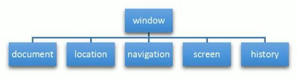
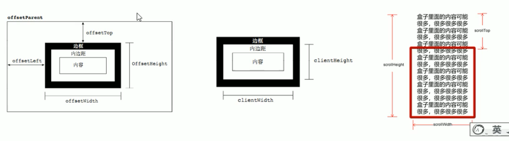

1. dom树
    - 文档 : 一个页面就是一个文档, dom中使用document表示
    - 元素: 页面中所有标签都是元素, dom中使用element表示
    - 节点: 网页中所有内容都是节点(标签,属性,文本,注释等), dom中使用node表示
2. 获取元素
    - `getElementById()`
    - `getElementsByClassName()`
    - `getElementsByName()`
    - `getElementsByTagName()`
    - `querySelector()`              --------> 根据指定选择器返回第一个元素对象
    - `querySelectorAll()`           
    - `document.body`                --->获取body元素
    - `document.documentElement`     --->获取html元素
3. 事件基础
    - `元素.onXXX = function(){....}`
    -  常见的事件有: onclick, onmouseover, onmouseout, onfocus, onblur, onmousemove, onmouseup, onmousedown
4. 操作元素样式
    - 操作元素内容: 
        - `element.innerText`       ---> 可读可写, 去除掉了html标签, 空格还有换行
        - `element.innerHTML`       ---> 可读可写, 全部内容, 包含了html标签,保留空格,和换行, 推荐使用这个
    - 操作常见元素属性: 
        - 图片的src alt title属性, a链接的href属性......
    - 操作表单元素属性:
        - type, value, checked, selected, disabled(禁用属性)
    - 操作元素样式属性
        - `element.style.xxx` 行内样式操作, css权重比较高, js修改style样式采用驼峰命名法
        - `element.className = "xxx"` 类名样式操作
    - 操作自定义属性
        - 读取属性
            - 1. `element.xxx` 得到名字为xxx的 内置 属性值, 比如id.....
            - 2. `element.getAttribute('data-xxx')` 主要用于 得到名字为xxx的 自定义 属性值
            - 3. 对于自定义属性, 还可以通过 `element.dataset.xxx`获取自定义的xxx属性值
                    - 对于自定义属性, 名称里面有多个-连接的话, 使用dataset获取的时候要使用驼峰命名法, data-today-weather  ---> todayWeather
        - 写入属性
            - 1. `element.xxx = "yyy"` 设置属性xxx的值为yyy
            - 2. `element.setAttribute('data-xxx', "yyy")` 主要用于 设置名字为xxx的 自定义 属性值为yyy
            - 特殊的一个就是class属性的写法, 一个是className 一个直接用class
                - `element.className = "yyy"`
                - `element.setAttribute("class", "yyy")`
        - 移除属性
            - `element.removeAttribute("xxx")` 删掉元素名字为xxx的属性

5. 节点 及其操作
    - 一般的,节点有nodeType, nodeName, nodeValue这三个基本属性
        - nodeType
            - nodeType == 1  ---> 元素节点
            - nodeType == 2  ---> 属性节点
            - nodeType == 3  ---> 文本节点(包含文本,空格,换行等)
                - 重点!!! 要小心, 因为后面获取子节点的时候就会用到这个区别了, 比如换行符不是我们想要的子节点
    - 节点层级
        - 父子节点
            - 获取父节点 `node.parentNode`   ---> 得到的是node的直接父节点
            - 获取子节点 `node.childNodes`   ---> 返回所有的子节点
                - 返回值里面包含了所有的子节点, 包括元素节点, 文本节点等, 如果只想要元素节点,还需要过滤一下, 所以不提倡使用childNodes
            - 获取子元素节点 `node.children`      --->返回所有的子**元素**节点
            - 获取第一个子节点 `node.firstChild` 返回第一个子节点, 不管这个节点类型是元素节点还是文本节点
            - 获取第一个子元素节点 `node.firstElementChild` 返回第一个子元素节点   ----- ie9以上才支持
            - 获取最后一个子元素节点 `node.lastElementChild` 返回最后一个子元素节点 ----- ie9以上才支持
            - 实际开发中,为了取到子节点又照顾兼容性, 只能使用`node.children(index)`来获取指定位置的子元素节点
        - 兄弟节点
            - `node.nextSibling` 获取node的下一个兄弟节点 包含文本节点, 元素节点等等
            - `node.previousSibling` 获取node的上一个兄弟节点 包含文本节点, 元素节点等等
            - `node.nextElementSibling` 获取node的下一个兄弟元素节点       ----- ie9以上才支持
            - `node.previousElementSibling` 获取node的上一个兄弟元素节点   ----- ie9以上才支持
            - 为了得到兄弟节点, 且照顾兼容性, 封装一个函数
                ```
                    function getNextElementSibling(element){
                        var el = element;
                        while(el = element.nextSibling){
                            if(el.nodeType == 1){
                                return el;
                            }
                        }
                        return null;
                    }
                ```
    - 创建节点
        - `document.createElement('tagName')` 创建由tagName指定的元素节点
    - 添加节点
        - `node.appendChild(child)` 将一个节点添加到指定节点的子节点列表尾部
        - `node.insertBefore(child, 指定元素)`将一个节点添加到父节点的指定的子节点的前面
    - 删除节点
        - `node.removeChild(child)` 删除一个子节点, 返回这个删除的节点
        - 举个栗子:
            ```
            //点击发布按钮, 将文本域里面的内容添加到列表里面 并增加删除链接
            var text = document.querySelector('textArea');
               btn.onclick = function(){
                   if(text.value == ""){
                       alert('没有输入内容');
                       return false;
                   }else{
                       var li = document.createElement('li');
                       li.innerHTML = text.value + "<a href='#'>删除</a>";
                       ul.insertBefore(li, ul.children[0]);
                   }
               } 
            ```
            // 上面这个例子里面的删除链接里面用了#, 点击这个链接的时候网页地址栏会多出一个#, 为了避免这种情况, 使用`href='javascript:;'`或者`href='javascript:void(0);'`
    - 复制节点  ----- 克隆节点
        - `node.cloneNode()` 复制一个节点, 并返回这个副本
            - 括号里面为空或者false, 是浅拷贝, 即只克隆复制节点本身, 不克隆里面的子节点
            - 括号里面为true, 是深拷贝, 复制节点本身及其所有的子节点
    - 创建元素的三种方式的区别:
        - 1. `document.write()` 
            - 直接将内容写入页面内的内容流, 但是在文档流加载完毕后, 再调用这个方法写入内容会导致整个页面全部重绘
        - 2. `ele.innerHTML = 'xxx'` 
            - 不会导致页面重绘
            - innerHTML创建多个元素效率更高  -----  但是不要使用字符串拼接, 采用数组存储最后拼接成字符串的形式, 结构稍微复杂
        - 3. `document.createElement('xxx')`
            - 不会导致页面重绘
            - 创建多个元素的时候效率比innerHTML稍微低一点, 但是结构更清晰
6. 高级事件
    - 注册事件
        - 传统注册方式
            - `<button onclick='alert("hi")'></button>`
            - `btn.onclick = function(){}`
            - 这种传统注册事件的方式, 具有**唯一性**
                - 同一个元素的同一个事件只能设置一个处理函数, 最后注册的处理函数将会覆盖前面注册的处理函数
        - 方法监听注册方式
            - `addEventListener(evtName, fun, [useCapture])`
            - ie9以前不支持此方法, 可用attachEvent代替 --- 不提倡在生产环境使用
                - `evtTarget.attachEvent(eventNameWithOn, callBack)`
            - 同一个元素的同一个事件可以注册多个监听器
            - 按照注册顺序依次执行
        - 注册事件兼容性解决方案
            - ```
                function addEventListener(ele, evtName, fun){
                    if(ele.addEventListener){
                        ele.addEventListener(evtName, fun);
                    }else if(ele.attachEvent){
                        ele.attachEvent('on' + evtName, fun);
                    }else{
                        ele['on' + evtName] = fun;
                    }
                }
              ```
    - 解绑事件
        - 传统事件解绑
            - `ele.onXXX = null;`
        - 方法监听事件解绑
            - `ele.removeEventListener(evtName, fun);`
            - `ele.detachEvent('on' + evtName, fun);`
        - 解绑事件兼容性处理
            - ```
                function removeListener(ele, evtName, fun){
                    if(ele.removeEventListener){
                        ele.removeEventListener(evtName, fun);
                    }else if(ele.detachEvent('on' + evtName)){
                        ele.detachEvent('on' + evtName, fun);
                    }else{
                        ele['on' + evtName] = null;
                    }
                }
              ```
    - DOM事件流
        - 捕获 --> 目标 --> 冒泡
        - js代码中只能执行捕获或者冒泡其中的一个阶段
        - `onXXX`和`attachEvent`只能得到冒泡阶段
            - `onblur`, `onfocus`, `onmouseenter`, `onmouseleave`没有冒泡事件
        - `addEventListener`第三个参数默认是false, 表示在冒泡阶段处理事件, true表示在捕获阶段处理事件
    - 事件对象
        - 事件监听函数的形参
        - 为了照顾兼容性 ---> ` = e || window.event`
        - 事件对象常见的属性和方法
            - `e.target` 触发事件的对象     --->标准
                - **e.target是触发事件的对象, 事件处理函数里面的this指向的注册事件的对象**
                - **`e.currentTarget`跟this类似, 都是指向注册事件的对象, ie6-8不支持e.currentTarget**
            - `e.srcElement` 触发事件的对象 --->非标准
            
            - `e.type` 事件的类型, 不带on
            -
             `e.cancelBubble = true;`阻止冒泡, 非标准, ie6-8使用
            - `e.returnValue` 阻止事件默认行为, 非标准, ie6-8使用
                - `return false`也能阻止事件的默认行为, 但是只限于传统事件的注册方式的函数里面使用, 且return false后面的代码就不能执行了
            
            - `e.preventDefault()`阻止事件的默认行为, 标准
            - `e.stopPropagation()`阻止冒泡, 标准
        
    - 事件委托
        - 不给每个子节点单独设置事件监听器, 而是给他们的父节点设置事件监听, 然后利用冒泡原理和e.target取到实际触发事件的子节点
        - 事件委托只操作了一次dom. 提高了性能

    - 常用的鼠标事件
        - 禁止鼠标右键菜单
            ```
                document.addEventListener('contextmenu', function(e){
                    e.preventDefault();
                })
            ```
        - 禁止鼠标选中
            ```
                document.addEventListener('selecstart', function(e){
                    e.preventDefault();
                })
            ```
    - 获得鼠标在页面中的坐标  重点!!!
        - `e.clientX | clientY` 返回鼠标相对于浏览器窗口可视区的X|Y坐标
        - `e.pageX | pageY` 返回鼠标相对于文档页面的X|Y坐标, ie9+支持 -----> 如果文档页面有滚动条 滚动到某一个阶段 点击的位置是相对于文档最左最上的坐标, 最左最上有可能是不可见的
        - `e.screenX | screenY` 返回鼠标相对于电脑屏幕的X|Y坐标
    - 键盘事件
        - `onkeyup`
        - `onkeydown`  --- 可以识别功能键, **keydown不区分大小写, 所以a和A的keycode都是65**
        - `onkeypress` --- 不能识别功能键(左右箭头 ctrl shift等), **keypress区分大小写, 所以a的keyCode是97, A的keycode是65**
        - 三个事件的执行顺序是 keydown --> keypress --> keyup
        - 键盘事件对象
            - e.key
            - e.keyCode
                - **keydown事件处理函数中, 获取到的keyCode不区分大小写, 所以a和A的keycode都是65**
                - **keypress事件处理函数中, 获取到的keyCode区分大小写, 所以a的keyCode是97, A的keycode是65**
            
        - 注意点总结:
            - 因为keydown 和 keypress问题多多, 所以有时候不是特地需要处理鼠标按下事件的, 可以用keyup来监听事件,比如在keyup里面获取keyCode更精确
            - 输入框input的keydown 和 keypress事件在触发的时候, 键入的文本是还没有进入文本框中的, 所以要用keyup来代替, 否则就会出按下的文本只能在下一次触发keydown|keypress才会获取到
    - `mouseenter`和`mouseover`的区别
        - 鼠标移动到元素上时候就会触发
        - mouseover经过自身盒子会触发, 经过子盒子还会触发, mouseenter只会经过自身盒子触发
        - 这是因为mouseenter不会冒泡
    - `mouseleave`和`mouseout`的区别同上
            
7. BOM
    - BOM比DOM更大, BOM包含DOM, `document.quertSelector('xxx')` ---> `window.document.querySelector('xxx')`
    - BOM的核心是window
     
    - window对象
        - window对象是js访问浏览器窗口的一个接口
        - window对象是一个全局对象, 定义在全局作用域中的变量, 函数都会变成window对象的属性和方法
    - window对象的常见事件
        - 窗口加载事件
            - 窗口加载事件是在文档的所有元素(图片,脚本文件,css等)全部加载完毕后, 才会触发该事件
            - `window.onload = function(){...}`  --- 这种传统注册方式只能有一个监听事件,如果有多个,以最后一个为准
            - `window.addEventListener('load', function(){...})` --- 可以有多个监听事件
            - 一个比较特殊的窗口加载事件
                - `document.addEventListener('DOMContentLoaded', function(){...}`
                - 当且仅当DOM加载完成后DOMContentLoaded事件触发, 不包括样式表css,图片,flash等等
                - ie9以上支持, 适用于页面图片比较多的时候, 需要等待较长时间的页面
                - 所以, DOMContentLoaded会比load事件执行的更快一点
            - 另一个比较特殊的窗口加载事件
                - `window.addEventListener('pageshow', function(e){...})`
                - pageshow事件在页面显示时候触发, 不管这个页面是否来自缓存.
                - 在重新加载的页面中,pageshow事件会在load事件后触发
                - pageshow事件处理函数中的事件对象e有个属性`persisted`用来是否是缓存中的页面触发的pageshow事件
                - 注意: pageshow事件是给window添加
                - 火狐浏览器中有个`往返缓存`, 这个缓存中不仅保留着页面数据,还保留了DOM和JS的状态, 也就是说将整个页面都保存在了内存中, 所以后退按钮不能刷新页面, 也就不会触发load事件了, 可以使用pageshow事件来捕获触发
        - 窗口调整大小事件
            - `window.onresize = function(){...}`
            - `window.addeventListener('resize', function(){...}`
        - 定时器
            - `let timeId = setTimeOut(fun, 毫秒数)`
            - `clearTimeOut(timeId)`
            - `let timeId = setInterval(fun, 毫秒数)`
            - `clearInterval(timeId)`
    - this指向
        - 一般情况下this始终指向调用它的那个对象
        - 1. 全局作用域下或者普通函数中this指向全局对象window (重点!!! **定时器里面的this也指向window**)
        - 2. 方法调用中谁调用this就指向谁
            - ```
                var obj = {
                    name: "张三",
                    sayHi: function(){
                        console.log(this); //this指向obj这个对象
                    }
                }
                ```
                ```
                btn.addEventListener('click', function(){
                    console.log(this);// this指向注册事件的对象, 这里就是btn
                })
                ```
        - 3. 构造函数中this指向构造函数的实例
            - ```
                function Fun(){
                    console.log(this);//this指向实例对象,这里就是下面实例fun
                }
                var fun = new Fun();
                ```
    - location对象
        - 用于获取或者设置窗体的URL, 并且可以用于解析URL
        - `location.href` 获取 或者 设置 整个URL
        - `location.host` 获取主机(域名)
        - `location.port` 获取端口
        - `location.pathname` 返回路径
        - `location.search` 返回参数  (?name=andy&age=18)
        - `location.hash` 返回片段 (#后面的内容, 常用于链接, 锚点)
        - `location.assign()`跟href一样, 可以跳转页面(也叫重定向页面), 会记录历史, 可以后退页面
        - `location.replace()` 替换页面, 不能记录历史, 所以不能后退页面
        - `location.reload()`重新加载当前页面, 相当于刷新按钮或者F5, 如果参数为true代表强制刷新ctrl+F5
    - navigator对象
        - navigator对象包含有关浏览器的信息
        - 常用的有userAgent属性, 返回了由客户机发送服务器的user-agent头部的值
    - history对象
        - `history.back()` 后退
        - `history.forward()` 前进
        - `history.go(xxx)` 前进后退xxx, 栗子: 1表示前进一个页面, -1表示后退一个页面
    - js执行机制:  同步和异步
        - 同步任务: 同步任务都放在主线程上执行, 形成一个**执行栈**
        - 异步任务: js的异步是通过回调函数实现的
            - 一般的, 回调函数有以下三种类型
                - 普通事件, 如click, resize等
                - 资源加载, 如load, error等
                - 定时器
            - 异步任务相关回调函数会被添加到**任务队列**中, 也叫消息队列
        - 执行机制:
            - 先执行执行栈中的同步任务
            - 异步任务(回调函数)放入任务队列中
            - 一旦执行栈中的同步任务执行完毕, 系统就会一次读取任务队列中的异步任务, 于是被读取到的异步任务结束等待状态, 进入执行栈, 开始执行
            - 如此周而复始, 形成**事件循环**eventloop
    


8. offset
    - `ele.offsetTop` 返回元素对于带有定位的父元素的上方的偏移
    - `ele.offsetLeft` 返回元素对于带有定位的父元素的左边框的偏移
    - `ele.offsetWidth` 返回自身包括padding, 边框, 内容区的宽度, 返回值不带单位
    - `ele.offsetHeight` 返回自身包括padding, 边框, 内容区的高度, 返回值不带单位
    - `ele.offsetParent` 返回作为该元素带有定位的父级元素, 如果父级都没有定位则返回body
    - offset 与 style区别
        - 1. offset可以获取任意样式表中的样式值, **style只能得到行内样式表中的样式值**
        - 2. **offset系列获取到的数值都是没有单位的**, style.width获得的是带有单位的字符串
        - 3. offsetWidth包含了border+padding+width, style.width获得不包含border+padding的值
        - 4. offsetWidth等属性是只读的不能赋值, style.width是可读写的
        - 5. 所以想要获取元素的大小或者位置, 用offset更合适, 但是要是想给元素更改值, 需要用style改变
    - offset练手栗子
        - 获取鼠标在盒子内的坐标
            ```
            <body>
                <div class='box'></div>
                <script>
                    var box = document.querySelector(".box");
                    box.addEventListener('mousemove', function(){
                        var x = e.pageX - this.offsetLeft;
                        var y = e.pageY - this.offsetTop;
                        this.innerHtml = `x=${x}, y=${y}`;
                    })
                </script>
            </body>
            ```
        - 拖动模态框
            ```
            //注意点1: 需mousedown, mousemove, mouseup三个事件支持
            //注意点2: 为什么需要mousedown呢, 因为需要在mousedown这一刻获取到鼠标相对于父元素的位置, 因为这一刻还是静态的, 模态框还没被拖动, 后面再mousemove事件里面需要根据鼠标在文档的距离减去这个鼠标在父元素的距离来获取到模态框的左边的距离和上边的距离
            //注意点3: 鼠标移动事件的侦听要写在mousedown事件里面, 鼠标移动事件侦听的移除要写在mouseup事件里面, 这样是为了防止鼠标按下就会触发移动和鼠标松开移动鼠标移动事件

            function move(e){
                    //获得模态框的左上边距(鼠标在页面的左|上位置减去鼠标点击处在盒子内部的左|上距离)
                    login.style.left = e.pageX - x + "px"; //重点!!! 千万记得加上单位哦
                    login.style.top = e.pageY - y + "px";
                })
            }
            title.addEventListener('mousedown', function(e){
                var x = e.pageX - e.offsetLeft;//获得鼠标点击处在盒子内部的位置
                var y - e.pageY - e.offsetTop;
                document.addEventListener('mousemove', move);
            }
            title.addEventListener('mouseup', function(e){
                document.removeEventListener('mousemove', move);
            })
            ```
        - 京东放大镜效果
            ```
            <div class="preview_wrap fl">
                <div class="preview_img">
                    
                    <div class="mask"></div>
                    <div class="big">
                        
                    </div>
                </div>
            </div>

            <script>
                var preview_img = document.querySelector('.preview_img');
                var mask = document.querySelector('.mask');
                var big = document.querySelector('.big');
                //1. 鼠标经过preview_img就显示或者隐mask和大图

            </script>
            
                //1. 鼠标经过preview_img就显示或者隐mask和大图
                preview_img.addEventListener('mouseover', function(e){
                    mask.style.display = 'block';
                    big.style.display = 'block';
                })
                preview_img.addEventListener('mouseout', function(e){
                    mask.style.display = 'none';
                    big.style.display = 'none';
                })
                
                //2. 鼠标移动的时候, 让遮罩层跟着鼠标移动
                preview_img.addEventListener('mousemove', function(e){
                    //2.1 先计算鼠标在preview_img盒子内部坐标(有个前提是要审查一下这个preview盒子的父级有没有定位)
                    var x = e.pageX - this.offsetLeft;
                    var y = e.pageY - this.offsetTop;
                    
                    //2.2.1 减去自身盒子宽度的一半 是为了让遮罩层的中心在鼠标处
                    var maskX = x - mask.offsetWidth/2;
                    vat maskY = y - mask.offsetHeight/2;
                    
                    //2.2.2 计算遮罩层的位置, 但是不能让遮罩层超出preview范围
                    var maskMaxX = preview_img.offsetWidth - mask.offsetWidth;
                    var maskMaxY = preview_img.offsetHeight - mask.offsetHeight;
                    if(maskX < 0){
                        maskX = 0;
                    }else if(mask > maskMaxX){
                        maskX = maskMaxX;
                    }
                    if(maskY < 0){
                        maskY = 0;
                    }else if(mask > maskMaxY){
                        maskY = maskMaxY;
                    }
                    
                    //2.2.3 赋值给遮罩层
                    mask.style.left =  maskX + 'px'; 
                    mask.style.top =  maskY + 'px';

                    //2.3 计算: 大图片移动距离 = (遮罩层移动距离 / 遮挡层最大移动距离) * 大图片最大移动距离;
                    var bigImg = document.querySelector('.bigImg');
                    var bigMaxX = bigIMg.offsetWidth - big.offsetWidth;//大图片的最大移动距离
                    var bigMaxY = bigIMg.offsetHeight - big.offsetHeight;//大图片的最大移动距离
                    var bigX = (maskX / maskMaxX) * bigMaxX;
                    var bigY = (maskY / maskMaxY) * bigMaxY;
                    bigImg.style.left = -bigX + 'px';// 这里要加一下负号, 是因为大图的移动方向跟遮罩层是相反的
                    bigImg.style.top = -bigY + 'px';
                })
            ```
9. client
    - client与offset最大的区别就是 client不包含边框border, offset包含
    - `ele.clientTop` 返回上边框的大小
    - `ele.clienLeft` 返回左边框的大小
    - `ele.clientWidth` 返回自身包括padding + 内容区的宽度, 不包含边框, 返回值不带单位
    - `ele.clientHeight` 返回自身包括padding + 内容区的高度, 不包含边框, 返回值不带单位
10. scroll
    - `ele.scrollTop` 返回被卷去的上侧距离, 返回数值不带单位
    - `ele.scrollLeft` 返回被卷去的左侧距离, 返回数值不带单位
    - `ele.scrollWidth` 返回自身实际的宽度, 不含边框,含有padding, 返回数值不带单位
    - `ele.scrollHeight` 返回自身实际的高度, 不含边框,含有padding, 返回数值不带单位  
    - scrollWidth/Height跟clientWidth/Height的区别在于如果内容很长或者很宽超出盒子范围了 scrollWidth/Height是包含了全部超出内容的部分的
    - 页面的滚动时候被卷去的距离
        - `window.pageXOffset` **页面**被卷去的左侧值
        - `window.pageYOffset` **页面**被卷去的上部值
    - 栗子:仿淘宝固定侧边栏
        ```
        var banner = document.querySelector('.banner');
        var bannerTop = banner.offsetTop;
        
        var slidebar = document.querySelector('.slide-bar');
        var slideBarTop = slideBar.offsetY - bannnerTop;//侧边栏变成固定定位之后应该变化的值

        var main = document.querySelector('.main');
        var goBack = document.querySelector('.goBack');
        var mainTop = main.offsetTop;
        document.addEventListener('scroll', function(e){
            //当页面被卷去了最上方banner的大小, 侧边栏就改为固定定位
            if(window.pageYOfsset >= bannerTop){
                slideBar.style.position = 'fixed';
                slideBar.style.top = slideBarTop + 'px';
            }else{
                slideBar.style.position = 'absolute';
                slideBar.style.top = '300px';
            }
            //当页面被卷去的的距离开始到达main主体的部分时候, goback按钮开始出现或者隐藏
            if(window.pageYOfsset >= mainTop){
               goBack.style.display = 'block';
            }else{
                goBack.style.display = 'none';
            }
        })
        ```
    - offset-client-offset三者区别
        
    
    

11. 动画
    - 渐渐变缓的动画算法实现 `每次移动的距离 = (目标位置 - 当前位置)/10`
    - 网页端轮播图
        - 定时器自动翻页, 相当于手动调用右翻页按钮的事件, 所以可以使用`right_btn.click();`实现
