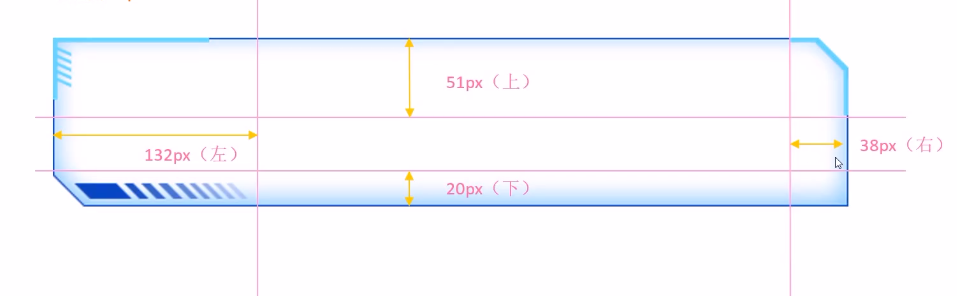
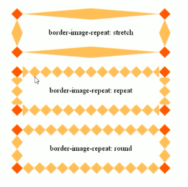

1. 常见的数据可视化库
    - D3.js : 目前web端评价最高的js可视化工具库,上手难
    - ECharts.js : 百度一款开源js数据可视化库
    - Highcharts.js : 国外的前端数据可视化库, 非商用免费, 被许多国外大公司使用
    - AntV : 蚂蚁金服全新一代数据可视化解决方案
2. Echarts可视化项目
    - 边框图片
        - 边框切图 : 九宫格图片
            - 把四个角切出去, 中间部分可以铺排, 拉伸, 环绕
            - 按照上右下左的顺序切割
            - `border-image-source: url('....')` 边框图片的路径
            - `border-image-slice` 边框图片裁切位置(裁剪的尺寸, **没有单位!!!**, 上右下左的顺序)
            - `border-image-width` 边框图片的宽度(要加单位,  指的只是边框图片的宽度, 不是边框的宽度, 所以不会向内挤压子盒子位置)
            - `border-image-repeat` 边框图片是否平铺repeat, 铺满(round), 拉伸(stretch), 默认是拉伸的
            - 
            - 
    - 通过类名调用字体图标
        1. html页面引入字体图标中css文件 -----> `<link rel='stylesheet' href='fonts/style.css'>`
        2. 标签直接调用图标对应的类名即可 (类名是在css文件中标注) -----> ``
